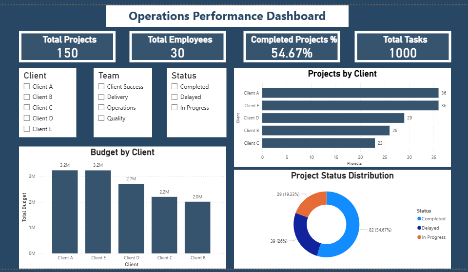
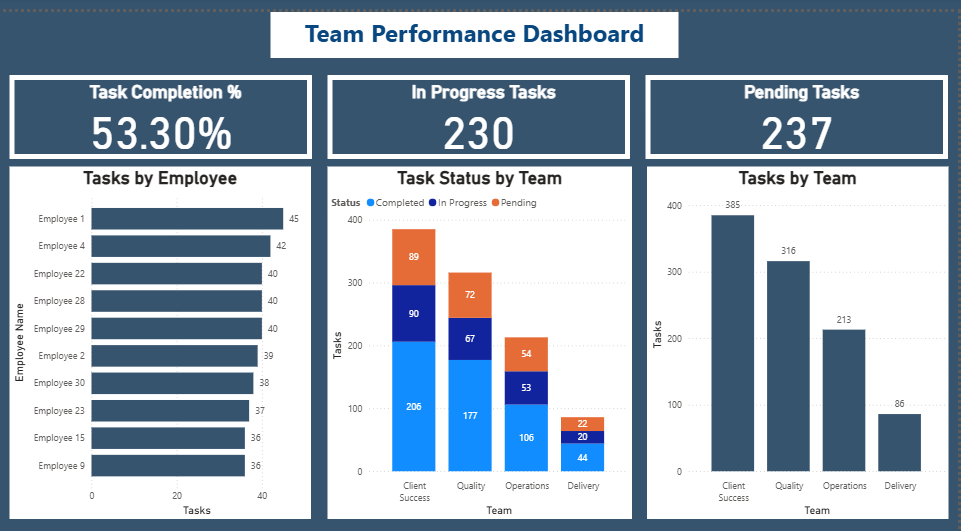

# Operations Performance Dashboard | Power BI

## Dashboard Preview

### Operations Overview

### Team Performance Dashboard

## Project Overview
This project is a 2-page Power BI dashboard built to analyze operational performance, project progress, client distribution, budgets, and team productivity.

The dashboard was designed to provide insights into project completion, workload distribution, resource utilization, and overall operational efficiency.

## Dataset
The project uses an Excel dataset consisting of four interconnected tables that simulate a real-world operations environment.

### Projects
Contains project-level information:
* Project ID
* Client
* Project Type
* Start Date
* Due Date
* Status
* Budget

### Tasks
Contains task-level information assigned to employees:
* Task ID
* Project ID
* Employee ID
* Assigned Date
* Completed Date
* Status

### Employees
Contains employee and organizational information:
* Employee ID
* Employee Name
* Team
* Manager

### SLA
Contains Service Level Agreement (SLA) targets for projects:
* Project ID
* SLA Target Days
The dataset was used for data cleaning, data modelling, KPI creation, and dashboard development in Power BI.

## Business Questions Addressed
* How many projects, tasks, and employees are involved?
* What percentage of projects have been completed?
* Which clients contribute the most projects and budget?
* What is the current status of projects?
* Which employees and teams have the highest workload?
* What is the task completion rate?
* Which teams have the highest backlog?

## Dashboard Pages

### Operations Overview
KPIs:
* Total Projects
* Total Employees
* Total Tasks
* Completed Projects %

Visuals:
* Projects by Client
* Budget by Client
* Project Status Distribution

### Team Performance Dashboard

KPIs:
* Task Completion %
* In Progress Tasks
* Pending Tasks

Visuals:
* Tasks by Employee
* Tasks by Team
* Task Status by Team

## Key Insights
* 54.67% of projects were completed.
* 53.30% of tasks were completed.
* Client A and Client E had the highest number of projects.
* Client Success handled the highest workload.
* Project workload and budget allocation varied across clients.

## Tools Used

* Power BI
* Power Query
* DAX

## Skills Demonstrated

* Data Cleaning
* Data Modelling
* Data Visualization
* KPI Reporting
* Dashboard Design
* Operations Analytics

## Files Included

* Operations_Performance_Dashboard.pbix
* Operations_Dashboard_Dataset.xlsx
* Operations_overview_dashboard.png
* Team_performance_dashboard.png
